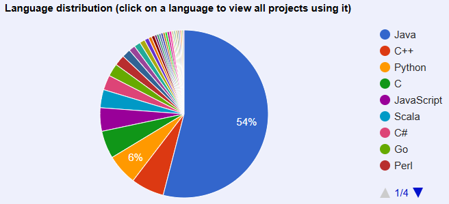

The beta release of the [Cloudflare R2 Data Catalog](https://developers.cloudflare.com/r2/data-catalog/)
opens the door for a fully featured, lowest cost (for the cloud/hybrid space), and 
relatively simple deployment of AI Software as a Service (SaaS) products. Combined with
[Prefect's bring your own compute](https://www.prefect.io/pricing) and a RAPIDS enabled 
Dask server running on a $1,500 desktop PC at your home or office, it's possible to 
develop, operate, and maintain a modern AI SaaS offering for well under $1,000 a month
and one developer. **This post is not sponsored** by Cloudflare, Prefect, or any other 
company.

<!-- more -->
# Building a Low-Cost Artificial Intelligence (AI) Software as a Service (SaaS): Part 1

## Introduction
For several years, I've led software, data, and AI engineering and innovation at one of 
the world's top 10 largest organizations. On nights and weekends, I've led a startup AI 
and technology company through partnerships with technology leaders in the automotive 
industry to commercialize an operational technology AI [I created in grad school](https://www.youtube.com/watch?v=KkgxFplsTnM).

This has led me to a holistic perspective on the challenges both extremely large and
extremely small organizations face when trying to incorporate AI into their core 
business processes. Talent, cost, performance, cultural change, velocity to market, 
and more play critical roles well before real time and thought can be put into what 
the AI algorithms are actually doing and how the business can optimize their use to 
gain an advantage.

My experiences with national-level success and unmitigated failures to harness AI 
and data to improve outcomes have led me to a few key opinions on how organizations 
big and small should contextualize greenfield and brownfield AI innovation.

> 1. Aggressively eliminate technology from the core value proposition unless it's 
     legitimately irreplaceable. Complexity = risk, time, and money
> 2. Cloud compute (vCPU, vGPU, vRAM) is overpriced
> 3. Cloud storage and content delivery networks (CDNs) offer extreme value
> 4. A gaming PC is a fixed cost high performance AI server

### Python, React, and SQL
Python, React, and SQL are the _lingua franca_ of modern software development related
to AI-enabled SaaS webapps. The [2024 Stack Overflow survey](https://survey.stackoverflow.co/2024/technology#most-popular-technologies)
overwhelmingly backs this up. Pursuing solutions that don't or barely support these 
languages will cause pain organizationally (hiring, training, knowledge 
management) and technologically by constraining your organization's options to pivot.

### Hybrid-cloud is the sweet spot
Cloud compute costs kill otherwise promising efforts to improve, modernize, and 
quickly deliver value. 
Hybrid-cloud deployment models allow use of the cloud where it provides outsized 
value like cheap, globally accessible, and failsafe blob storage like AWS S3 or 
Cloudflare R2.
Fixed cost and cheap on-premises self-hosted hardware can be seamlessly integrated 
with high value cloud services for free using technology like [Cloudflare Tunnels](https://developers.cloudflare.com/cloudflare-one/connections/connect-networks/) 
and [wireguard](https://www.wireguard.com/).

For less than an economy car, even individuals can afford to build a rack mount or 
desktop server with cutting edge GPUs, terabytes of ultra-fast nVME storage, over a 
hundred physical CPU cores, and a decent network security setup. This effectively drops
the cost to run AI models, data engineering pipelines, and APIs for the price of one or
two months doing the same on cloud hosted hardware. Better yet, if the business or 
project fails, the hardware purchased likely has residual value and can be resold to 
recoup some of the upfront cost. Self-hosting computational tasks also mitigates the 
risk of waking up to find an astronomical bill from your cloud provider because of a 
silly, but all to easy to make, mistake.

### Use Kubernetes (K8s) when you can... but don't let it hinder an MVP
Kubernetes, Helm, Terraform, and other leading cloud orchestration tools are 
tremendously valuable when used by trained engineers. Nearly every technology 
organization that's growing will need to use and master them at some point. However, 
Docker Compose and Docker Swarm provide completely functional options for 
development of a minimal viable product (MVP) that uses software likely already on your
development and production computers. Prematurely introducing complexity and trying 
to troubleshoot the myriad problems that can arise from a K8s deployment is not a 
good use of time early in an AI SaaS project's lifecycle. When it's time to 
transition to Kubernetes, [tools like Kompose](https://kompose.io/) can minimize the 
pain and time to do so.

### As of 2025, production data engineering is a tangled web of Java technology
> Spark :simple-apachespark: is king... long live Spark?

The [Apache Foundation](https://projects.apache.org/projects.html?number) is more or 
less a 1-stop shop for finding many of the best open source data engineering projects 
underpinning the data and AI hype cycles over the past 20 years. Some of the major 
offerings broadly used in production are...

The original "Big Data" projects:

* :simple-apachehadoop: [Apache Hadoop](https://projects.apache.org/project.html?hadoop)
* :simple-apachespark: [Apache Spark](https://projects.apache.org/project.html?spark)
* :simple-apachekafka: [Apache Kafka](https://projects.apache.org/project.html?kafka)
* :simple-apachehive: [Apache Hive](https://projects.apache.org/project.html?hive)
* :simple-apachenifi: [Apache NiFi](https://projects.apache.org/project.html?nifi)
* :simple-apacheairflow: [Apache Airflow](https://projects.apache.org/project.html?airflow)
* :simple-apachecassandra: [Apache Cassandra](https://projects.apache.org/project.html?cassandra)

The newer generation gradually gaining market share:

* [Apache Icerberg](https://projects.apache.org/project.html?iceberg)
* [Apache Arrow](https://projects.apache.org/project.html?arrow)
* :simple-apacheparquet: [Apache Parquet](https://projects.apache.org/project.html?parquet)
* :simple-apachesuperset: [Apache Superset](https://projects.apache.org/project.html?superset)
* :simple-apachedruid: [Apache Druid](https://projects.apache.org/project.html?druid)
* [Apache DataFusion](https://projects.apache.org/project.html?datafusion)
* [Apache Beam](https://projects.apache.org/project.html?beam)

The percentage of each programming language used in Apache Foundation projects tells 
a clear story that Java is far and away the dominant choice. This has the potential 
to clash with the modern AI and talent ecosystem that revolves around Python and SQL. 
The newer Apache projects, like Beam and Superset, address this friction point by 
either being Python or SQL based from the outset or have a Python and SQL 
programming interface (API).

There are three important takeaways about the Java and Python data and AI ecosystem 
divide that I offer are worth remembering throughout this series on building an AI SaaS 
platform.

1. The global culture and conventional wisdom in the technology industry is based on
   companies spending most of the 2000s successfully operating using on-prem Apache 
   Java-based offerings. Leads for greenfield and brownfield modernization should 
   maintain an open, but skeptical, mindset to differentiate genuinely rock-solid 
   tech versus opting for something like Spark simply because you've used in on 
   previous projects or 'everyone' is using it.
2. Many of the newer Apache and non-Apache projects are objectively more performant, 
   cost-effective, and adaptable than their predecessors. One example is the separation 
   of compute and storage in Apache Iceberg, allowing dramatic cost savings, compared to
   Hadoop deployments.
3. Just because a project advertises support for Python or SQL doesn't mean it can 
   be quickly incorporated into a modern data and AI project. Apache Beam, Spark, 
   Kafka, and more subtly rely on Java-based orchestration like Zookeeper and Maven to
   operate. Your team likely barely understands or has never heard of these unless 
   they've been in the Java data space for a while. This quickly leads to 
   investing tons of time and money trying to get these secondary services working and
   integrated into your workflow that could otherwise be focused on delivering 
   tangible value.

## Goals and assumptions heading into developing a greenfield AI SaaS

