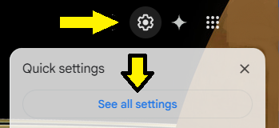
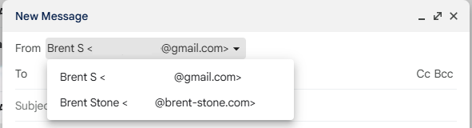

For nearly free, enhance the professionalism of your online persona by adding an alias
to gmail with your custom domain name like brent-stone.com. This avoids needing to pay
monthly fees for services like Google Workspace if all you're really after is a custom
email address.

<!-- more -->
## Summary
By combining Gmail with Cloudflare domain registration, it's possible to get a custom
and professional email address for the rock-bottom price of the annual ICANN domain
registration fee of about $11 per year. This is because Cloudflare allows _incoming_
mail to be redirected to your free Gmail account. Gmail allows outgoing mail to use that
same email alias so long as you control the domain.

## Requirements
1. A free gmail address
2. A free Cloudflare account
3. A domain, like my brent-stone.com, [using Cloudflare as your registrar](https://www.cloudflare.com/products/registrar/).

## Step One: Alias _inbound_ email on Cloudflare
1. Login to [the Cloudflare Dashboard](https://dash.cloudflare.com) and select the
   domain you'd like to use for your email alias.

      

2. Enter the "Email Routing" menu

      

3. Select the "Routing rules" tab and "Create address" button to create an inbound
   email routing alias.

      {#custom_address}

4. Pick what you'd like the public alias to be. Keep the `Action` as the default of
   "Send to an email" and type your free gmail address in the `Destination` field.
   You should now see an entry that looks similar to the picture above.

      

5. We'll need to include Google's information in the `TXT` DNS record cloudflare
   just created to allow the alias to be associated with your gmail account.

      * In the Cloudflare Dashboard for your domain, expand the `DNS` menu and select
      `Records`
      * Find the `TXT` record that has `v=spf1....` in the value. Click `Edit`
      * !!! Warning "Trust but Verify"

            Verify this guide isn't out of date! If the `mx.cloudflare.net` alias
            isn't what's originally shown in the TXT record automatically created by
            cloudflare, make sure to keep whatever the current alias is instead of
            replacing it. Simply add the `include:_spf.google.com`

        Replace the value with the following.
          ```
          v=spf1 include:_spf.google.com include:_spf.mx.cloudflare.net ~all
          ```

      

6. Test it out. Try sending an email to yourself using the new custom email address
   as the email recipient.

## Step Two: Alias _outbound_ email on Gmail
1. [Turn on two-factor authentication](https://myaccount.google.com/signinoptions/two-step-verification)
   for the Google account you'll use for email.

2. !!! Note "Write down the app password"

        Don't forget to temporarily copy-paste your app password somewhere safe. It
        won't be shown to you again and [you'll need it later](#app_password_needed).

    Create an [app password](https://security.google.com/settings/security/apppasswords)
    for your Google account.

    
    {#app_password}

3. In Gmail, click the Gear :octicons-gear-16: in the top right and select "See
   all settings"

    

4. Under the "Accounts and Import" tab click the blue link for "Add another email
   address"

    

5. Type the name you'd like to appear in emails sent to others and the new custom email
   address you [previously setup](#custom_address) for _inbound_ traffic on Cloudflare.

    

6. Use the following settings to configure _outbound_ emails.

       * `SMTP Server:` smtp.gmail.com
       * `Username:` your @gmail.com account (including the @gmail)
       * `Password:` The [app password](#app_password) created earlier

    {#app_password_needed}

## Step Three: Test Inbound and Outbound Email
1. Refresh the browser on the normal Gmail landing page where you read and write emails.
2. Click the "Compose" button. You should now see a dropdown in the `From` box with
   your normal @gmail.com and your custom alias. Select the custom alias and send
   yourself a quick test email.

    

3. ?????
4. Profit