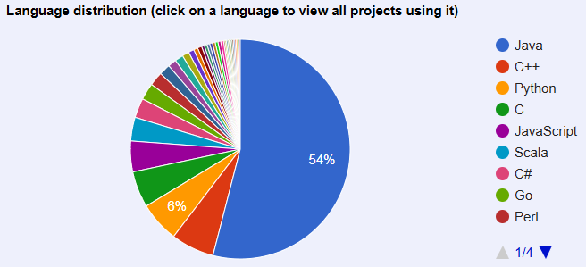

## As of 2025, production data engineering is a tangled web of Java technology
> Spark :simple-apachespark: is king... long live Spark?

The [Apache Foundation](https://projects.apache.org/projects.html?number) is more or
less a 1-stop shop for finding many of the best open source data engineering projects
underpinning the data and AI hype cycles over the past 20 years. Some of the major
offerings broadly used in production are...
<!-- more -->

The original "Big Data" projects:

* :simple-apachehadoop: [Apache Hadoop](https://projects.apache.org/project.html?hadoop)
* :simple-apachespark: [Apache Spark](https://projects.apache.org/project.html?spark)
* :simple-apachekafka: [Apache Kafka](https://projects.apache.org/project.html?kafka)
* :simple-apachehive: [Apache Hive](https://projects.apache.org/project.html?hive)
* :simple-apachenifi: [Apache NiFi](https://projects.apache.org/project.html?nifi)
* :simple-apacheairflow: [Apache Airflow](https://projects.apache.org/project.html?airflow)
* :simple-apachecassandra: [Apache Cassandra](https://projects.apache.org/project.html?cassandra)

The newer generation gradually gaining market share:

* [Apache Icerberg](https://projects.apache.org/project.html?iceberg)
* [Apache Arrow](https://projects.apache.org/project.html?arrow)
* :simple-apacheparquet: [Apache Parquet](https://projects.apache.org/project.html?parquet)
* :simple-apachesuperset: [Apache Superset](https://projects.apache.org/project.html?superset)
* :simple-apachedruid: [Apache Druid](https://projects.apache.org/project.html?druid)
* [Apache DataFusion](https://projects.apache.org/project.html?datafusion)
* [Apache Beam](https://projects.apache.org/project.html?beam)

/// caption
[Apache Foundation Project Code Use](https://projects.apache.org/)
///

The percentage of each programming language used in Apache Foundation projects tells
a clear story that Java is far and away the dominant choice. This has the potential
to clash with the modern AI and talent ecosystem that revolves around Python and SQL.
The newer Apache projects, like Beam and Superset, address this friction point by
either being Python or SQL based from the outset or have a Python and SQL
programming interface (API).

There are three important takeaways about the Java and Python data and AI ecosystem
divide that I offer are worth remembering when building an AI SaaS platform.

1. The global culture and conventional wisdom in the technology industry is based on
   companies spending most of the 2000s successfully operating using on-prem Apache
   Java-based offerings. Leads for greenfield and brownfield modernization should
   maintain an open, but skeptical, mindset to differentiate genuinely rock-solid
   tech versus opting for something like Spark simply because you've used in on
   previous projects or 'everyone' is using it.
2. Many of the newer Apache and non-Apache projects are objectively more performant,
   cost-effective, and adaptable than their predecessors. One example is the separation
   of compute and storage in Apache Iceberg, allowing dramatic cost savings, compared to
   Hadoop deployments.
3. Just because a project advertises support for Python or SQL doesn't mean it can
   be quickly incorporated into a modern data and AI project. Apache Beam, Spark,
   Kafka, and more subtly rely on Java-based orchestration like Zookeeper and Maven to
   operate. Your team likely barely understands or has never heard of these unless
   they've been in the Java data space for a while. This quickly leads to
   investing tons of time and money trying to get these secondary services working and
   integrated into your workflow that could otherwise be focused on delivering
   tangible value.