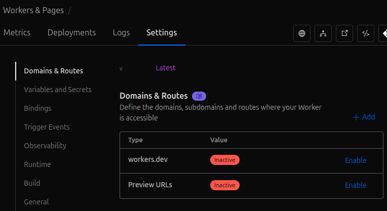

## Initial React Router v7 + Cloudflare D1 Setup

In a few minutes we'll transition from a new git repository to a hybrid cloud web application with best practice
secrets management, a serverless Cloudflare D1 Database managed by the [Drizzle ORM](https://orm.drizzle.team/), and a
seamless transition from local development to global production. This is thanks to the
[routinely updated project templates](https://github.com/remix-run/react-router-templates/tree/main) available from the
React Router team. The latest open source code is [available in the companion GitHub repository](https://github.com/brent-stone/hybrid_cloud_AI_SaaS).

<!-- more -->

## Initialize the repository from the Cloudflare D1 Template

### Local development environment
The [companion](https://github.com/brent-stone/hybrid_cloud_AI_SaaS) and [React Router Templates](https://github.com/remix-run/react-router-templates/tree/main)
repositories include information for setting up your local [Node.js](https://github.com/nvm-sh/nvm) development environment.

### Using the React Router Cloudflare D1 template
The React Router teams' Cloudflare D1 template will guide you through the process of creating a new project incorporating:

* [Cloudflare Wrangler](https://developers.cloudflare.com/workers/wrangler/): CLI for deploying code to Cloudflare Workers
* React Router 7 TypeScript Boilerplate
* [Vite](https://vite.dev/): build and package the React Router managed assets
* A placeholder Drizzle ORM Schema

```bash
npx create-react-router@latest --template remix-run/react-router-templates/cloudflare-d1
```

#### Secrets and sensitive information management
Environment variables will be securely stored using
[Cloudflare's environment management dashboard](https://developers.cloudflare.com/workers/configuration/environment-variables/#add-environment-variables-via-the-dashboard)
and locally in a
[.dev.vars](https://developers.cloudflare.com/workers/configuration/environment-variables/#compare-secrets-and-environment-variables)
and `.env` files which Cloudflare Wrangler uses by default. The state of both the local file and what is in the
cloudflare dashboard will need to be manually maintained.

In the future, [Cloudflare Secrets Store](https://developers.cloudflare.com/secrets-store/) will be a streamlined
and secure method for maintaining a single source of truth for environment variable secrets. As of this post, it is
currently in open beta. The main benefits of that approach is all developers working off the same account will always
have the same environment variable setup. It also eliminates the need to somehow send `.dev.vars` or `.env` files back
and forth which creates ample opportunity for exposing critical information.

### Create a new Cloudflare D1 Database using Wrangler
The [Cloudflare D1 Database](https://developers.cloudflare.com/d1/) service can be edited using the Cloudflare dashboard
or directly from the local computer using the Wrangler CLI. Follow the directions in the
[React Router Cloudflare D1 Template](https://github.com/remix-run/react-router-templates/tree/main/cloudflare-d1) to use
Wrangler to quickly create a new D1 database and get back metadata we'll need to save in our environment variables.
Additional information and details are available in the [Cloudflare D1 'Get Started' page](https://developers.cloudflare.com/d1/get-started/).

!!! note "Good Database Naming"

    For reference, a good database name:

    Uses a combination of ASCII characters, shorter than 32 characters, and uses dashes (-) instead of spaces.
    Is descriptive of the use-case and environment. For example, "staging-db-web" or "production-db-backend".
    Only describes the database, and is not directly referenced in code.

```bash
npx wrangler d1 create <name-of-your-database>
```

Save the output to environment variables in `.dev.vars` and `.env` files in the top level of the project directory like so

=== "Output from `wrangler d1 create`"
    Created your new D1 database.

    ```json hl_lines="5-6"
    {
      "d1_databases": [
        {
          "binding": "DB",
          "database_name": "<name-of-your-database>",
          "database_id": "<unique-ID-for-your-database>"
        }
      ]
    }
    ```

=== "Official `.env` example"

    Cloudflare's currently supported environment variables and example `.env` file are
    [available here](https://developers.cloudflare.com/workers/wrangler/system-environment-variables/#example-env-file).
    Since recommended best practices change frequently, be sure to verify the current guidance before trusting the
    example in the next tab.

=== "`.dev.vars` / `.env`"

    ```ini
    # For drizzle.config.ts
    CLOUDFLARE_ACCOUNT_ID=<YOUR_ACCOUNT_ID_VALUE>
    CLOUDFLARE_API_TOKEN=<YOUR_API_TOKEN_VALUE>
    CLOUDFLARE_DATABASE_ID=<YOUR_DATABASE_ID_VALUE>

    # Additional vars
    CLOUDFLARE_DATABASE_NAME=<YOUR_DATABASE_NAME>
    CLOUDFLARE_EMAIL=<YOUR_EMAIL>
    WRANGLER_SEND_METRICS=true
    CLOUDFLARE_API_BASE_URL=https://api.cloudflare.com/client/v4
    WRANGLER_LOG=debug
    WRANGLER_LOG_PATH=../Desktop/my-logs/my-log-file.log
    ```

The [Drizzle Cloudflare D1 documentation](https://orm.drizzle.team/docs/guides/d1-http-with-drizzle-kit) has information
on finding Account ID, Database ID, and creating an API token needed for your `drizzle.config.ts` and `.dev.vars`
configuration files. To create a Cloudflare D1 and Workers edit API token:

1. login to your Cloudflare account
2. Click the profile icon in the top right corner :octicons-person-fill-16: > `Profile`
3. `API Tokens`
4. Select the settings as shown below, replacing `<descriptive name>` with your own value
    * Account - D1 - Edit
    * Account - Workers Scripts - Edit
    * User - User Details - Read


### Test and verify initial configuration works
Create a local version of the SQLite D1 database and run the minimal React Router webapp to verify the TypeScript and
database works locally

#### Test Local Development
Install the dependencies:
```bash
npm install
```

Run an initial database migration (this will be only on the local computer)"
```bash
npm run db:migrate
```

Start the development server with HMR:
```bash
npm run dev
```

Open the application at [`http://localhost:5173`](http://localhost:5173) and test adding a couple names and emails in
the form. Refresh to verify the values entered persist.


#### Test Cloudflare Deployment
Verify that the private configuration information, like your Cloudflare D1 API key, are working with wrangler and
adjusting the D1 database stored by Cloudflare.

1. Ensure `drizzle.config.ts` references environment variables set in your `.env` file and matches
[the Drizzle Kit Cloudflare D1 quickstart](https://orm.drizzle.team/docs/guides/d1-http-with-drizzle-kit).

2. Use `npm` and wrangler to call the Cloudflare API to update the D1 database with the schema defined in `.\database\schema.ts`

    ```bash
    npm run db:migrate-production
    ```

3. Verify the migration appears in the D1 Database in the Cloudflare Dashboard.

    * Login to [the Cloudflare Dashboard](https://dash.cloudflare.com/)
    * `Storage & Databases` > `D1 SQL Database`
    * Click the `<name-of-your-database>` set earlier
    * Click the `Tables` tab
    * Verify the `guestBook` and `__drizzle_migrations` tables are present

    Take a look at the remote (on Cloudflare) database with the Drizzle Studio application available at
    [https://local.drizzle.studio](https://local.drizzle.studio) after starting the server:
    ```bash
    drizzle-kit studio
    ```

    Try making a new record in the `guestBook` table using Drizzle Studio and verify it shows up in the Cloudflare
    Dashboard data for the cloud hosted version of the `guestBook` table.

4. Deploy a preview URL

```bash
npm run build
```

```bash
npx wrangler versions upload
```

```bash
npx wrangler versions deploy
```

!!! hint "Selecting deployment version"

      When using the Wrangler CLI for deployment, use the up and down arrows and press the `space` key to select which
      deployment version to use prior to continuing using the `enter` key


### Activating DNS Routing to Preview Production Application
In order to visit your website hosted on cloudflare, you'll need to enable routing.

1. In the Cloudflare Dashboard, select `Compute (Workers)` > `Workers & Pages`
2. Select the project name (taken from your Git project name)
3. `Settings` > `Domains & Routes`
4. Click `Enable` next to the listings under `Domains & Routes`




## Cloudflare Wrangler and Vite
As noted in the Cloudflare Wrangler environments documentation:

!!! note

    If you're using the [Cloudflare Vite plugin](https://developers.cloudflare.com/workers/vite-plugin/), you select
    the environment at dev or build time via the `CLOUDFLARE_ENV` environment variable rather than the --env flag.
    Otherwise, environments are defined in your Worker config file as usual. For more detail on using environments with
    the Cloudflare Vite plugin, refer to the [plugin documentation](https://developers.cloudflare.com/workers/vite-plugin/reference/cloudflare-environments/).